A Simple FrameWorK of GAN.


## Usage


```
┌── data # the path of data
│	├── mnist
│	├── cifar10
│	├── celeba
│	└── hdf5data # we select HDF5 file for training in default, which could be created automatically
│		├── cifar10.hdf5 # Refer to src/datasets.py for more details.
│		└── celeba.hdf5
├── gfk
│	├── freeplot # for saving image
│	├── infos # for saving trained model including generator and discriminator
│	├── logs # The curve of varying of G_loss, D_loss, FID, IS along with steps increasing
│	├── metrics # The implementation of FID and IS
│	├── models # Architectures
│	└── src
│		├── augmentation.py # some augmentations
│		├── base.py # Coach, arranging the training procdure
│		├── config.py # You can specify the ROOT and HDF5 as the path of training data.
│		├── datasets.py # how to load and save data
│		├── dict2obj.py
│		├── loadopts.py # for loading
│		├── loss_zoo.py # The implementations of bce, hinge, wgan, leastsquares loss ...
│		└── utils.py # other usful tools
└── main.py # the main file
```


## Ablation


|       Setting       | IS(⭡) | FID(⭣) | Collapse Steps |
| :-----------------: | :---: | :----: | :------------: |
|     DCGAN + BCE     | 2.584 | 17.95  |     48000      |
|    DCGAN + Hinge    | 2.493 | 22.78  |     52000      |
| DCGAN + LeastSquare | 2.57  | 20.42  |     100000     |
|    DCGAN + WLoss    | 2.672 | 17.57  |     100000     |
|  DCGAN + BCE + SN   | 2.702 | 23.16  |     74000      |
| DCGAN + Hinge + SN  | 2.559 |  19.4  |     44000      |
|  DCGAN + BCE + EMA  | 2.613 | 15.88  |     48000      |
| DCGAN + Hinge + EMA | 2.578 | 17.650 |     52000      |
|  DCGAN + LS + EMA   | 2.56  | 15.92  |     100000     |
| DCGAN + WLOSS + EMA | 2.614 | 14.93  |     100000     |
|                     |       |        |                |


**Note**: We choose the result before collapse if occurred.


### Steps


```
python main.py celeba --steps=100000
```


|                             Loss                             |                            IS(⭡)                             |                            FID(⭣)                            |
| :----------------------------------------------------------: | :----------------------------------------------------------: | :----------------------------------------------------------: |
| 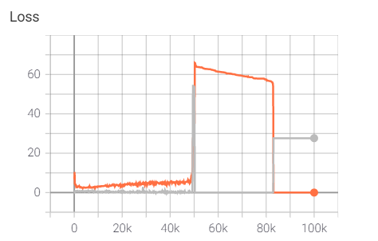 | 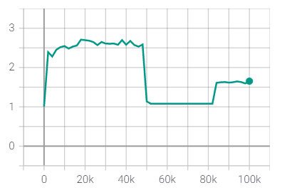 | 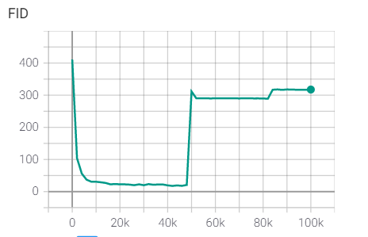 |


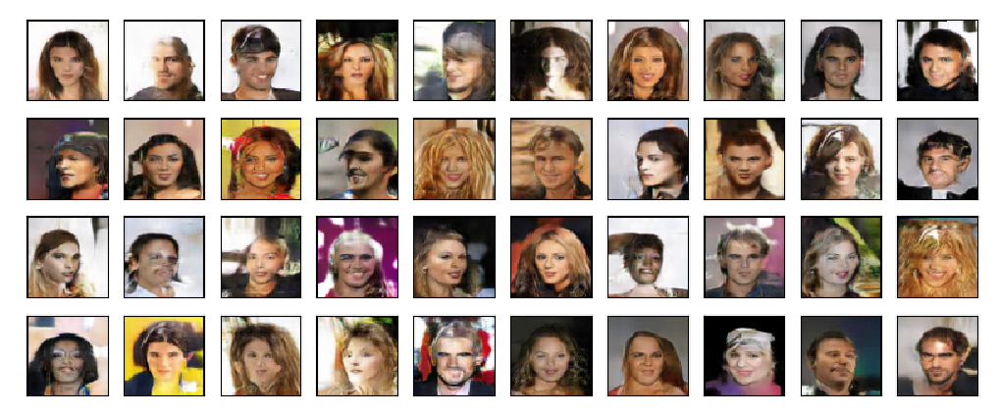


### Loss


|       |                             Loss                             |                            IS(⭡)                             |                            FID(⭣)                            |
| :---: | :----------------------------------------------------------: | :----------------------------------------------------------: | :----------------------------------------------------------: |
| hinge | 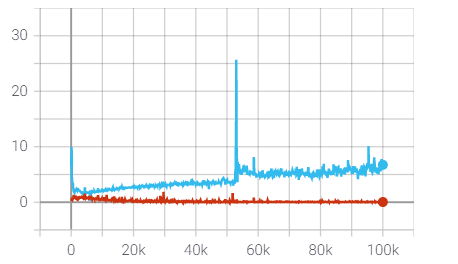 | 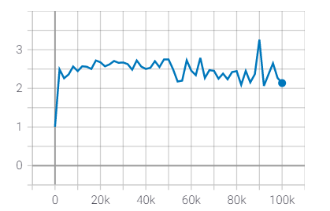 | 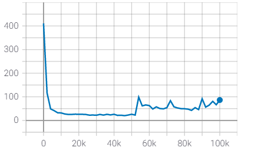 |
|  LS   | 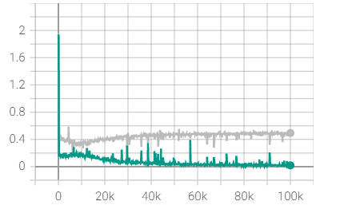 | 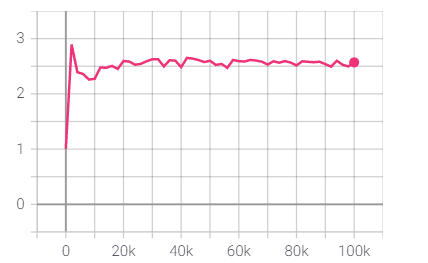 | 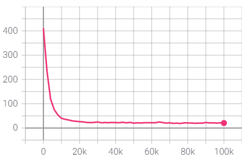 |
| wloss | 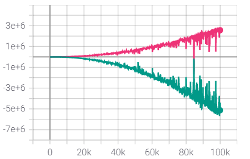 | 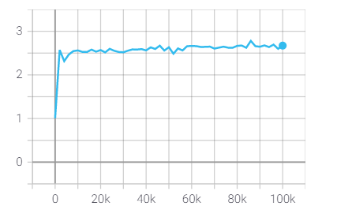 | 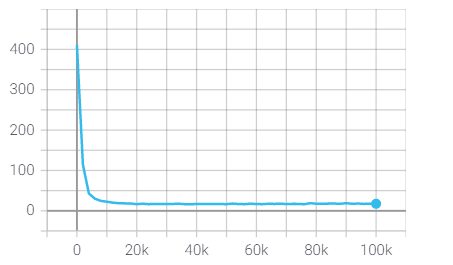 |


#### hinge

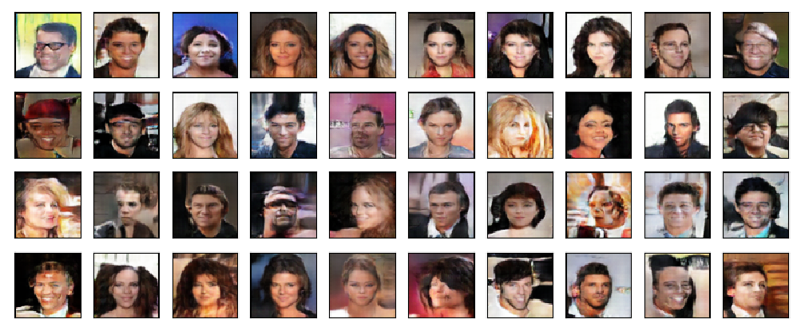


#### LS


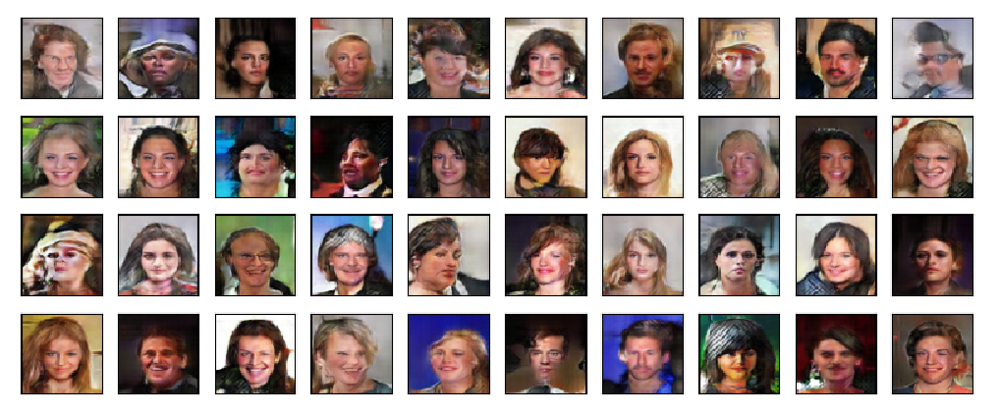


#### WLoss

**note:** I did not impose the gradient penalty on generator or discriminator, though it seems work well.

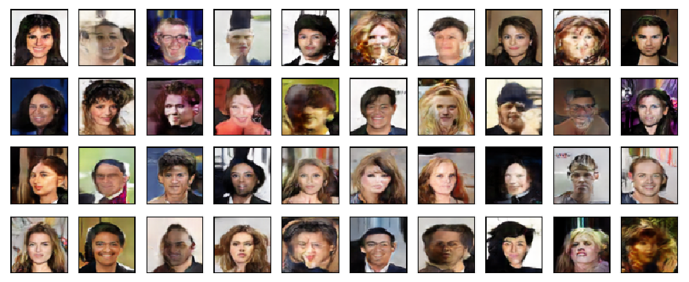


### Spectral Normalization


```
python main.py celeba -sng -snd
```


It seems that spectral normalization does little to small models, or a wrong implementation ?


|       |                             Loss                             |                            IS(⭡)                             |                            FID(⭣)                            |
| :---: | :----------------------------------------------------------: | :----------------------------------------------------------: | :----------------------------------------------------------: |
|  BCE  | 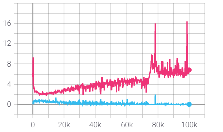 | 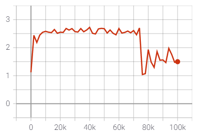 | 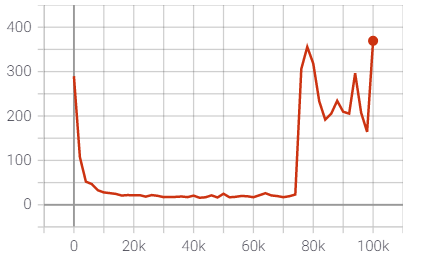 |
| Hinge | 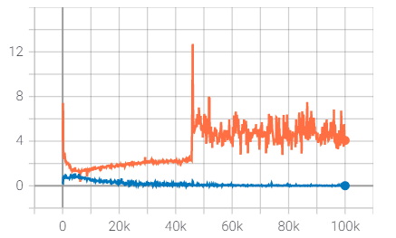 | 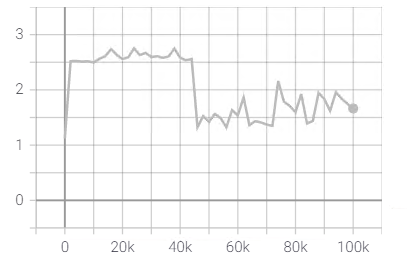 | 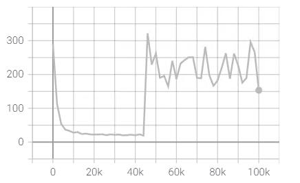 |


#### BCE


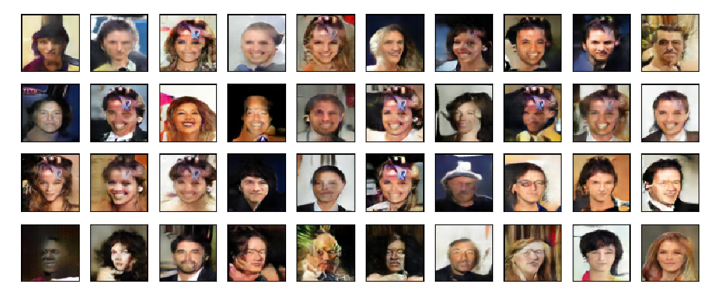


### Hinge


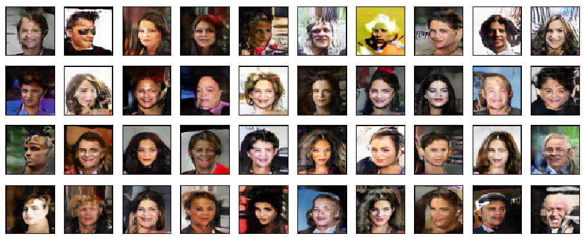


### EMA


EMA works so well in my sense.

```
python main.py celeba --ema
```


|       |                             Loss                             |                            IS(⭡)                             |                            FID(⭣)                            |
| :---: | :----------------------------------------------------------: | :----------------------------------------------------------: | :----------------------------------------------------------: |
|  BCE  | 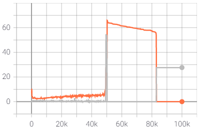 | 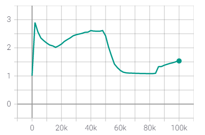 | 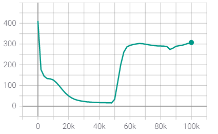 |
| Hinge | 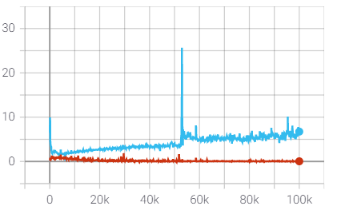 | 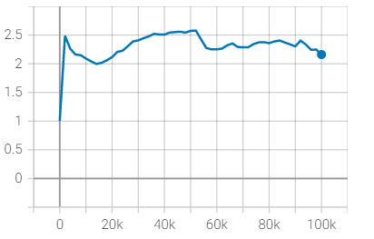 | 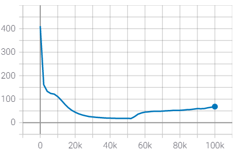 |
|  LS   | 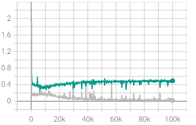 | 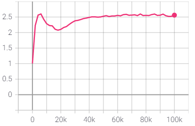 | 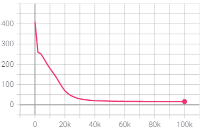 |
| WLoss | 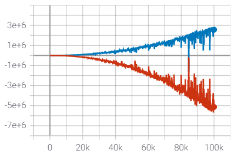 | 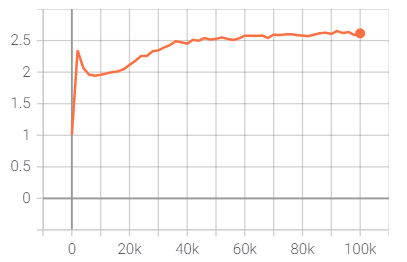 | 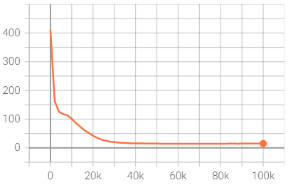 |


####  BCE

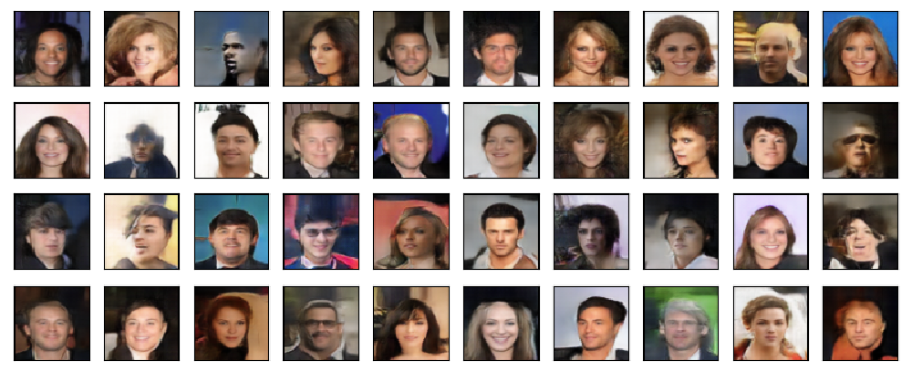


#### Hinge


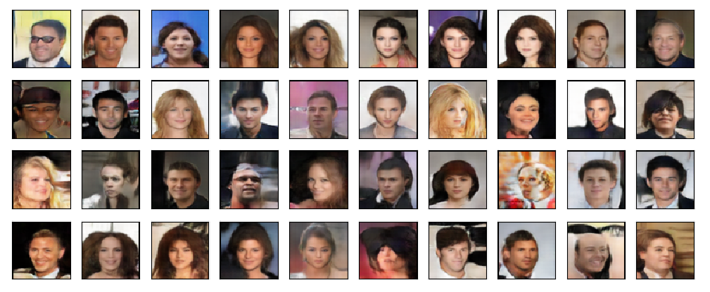


#### LS


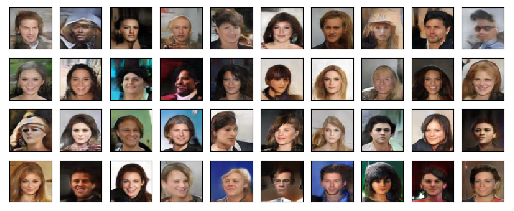


#### WLoss


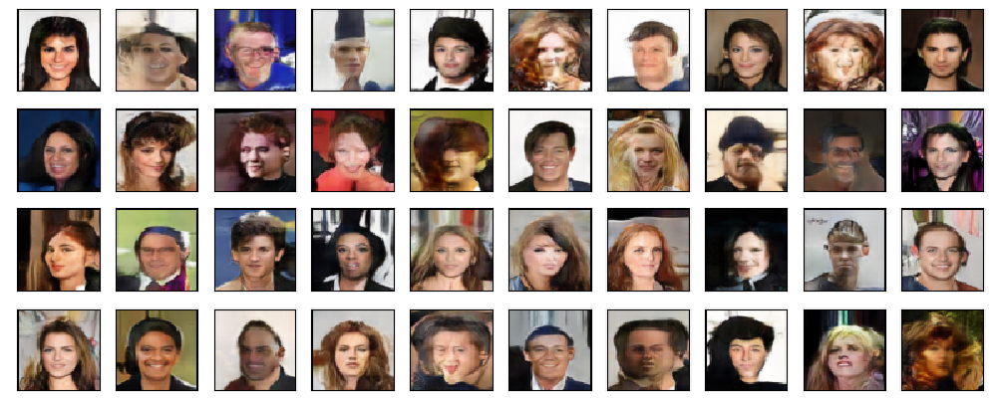


### Truncated Normal


```
python main.py celeba --rtype=tnormal
```


|      |      |      |      |
| :--: | :--: | :--: | :--: |
|      |      |      |      |

