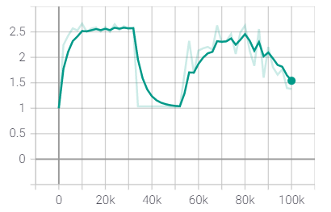
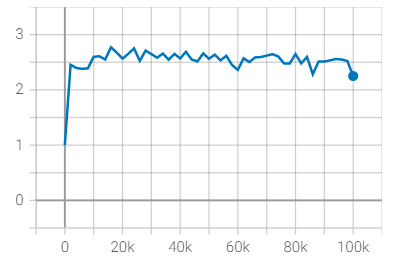

A Simple FrameWorK of GAN.


The corresponding trained models could be downloaded [here]([A Collection of Trained DCGAN under different settings | Zenodo](https://zenodo.org/record/4759263)).


## Usage


```
┌── data # the path of data
│	├── mnist
│	├── cifar10
│	├── celeba
│	└── hdf5data # we select HDF5 file for training in default, which could be created automatically
│		├── cifar10.hdf5 # Refer to src/datasets.py for more details.
│		└── celeba.hdf5
├── gfk
│	├── freeplot # for saving image
│	├── infos # for saving trained model including generator and discriminator
│	├── logs # The curve of varying of G_loss, D_loss, FID, IS along with steps increasing
│	├── metrics # The implementation of FID and IS
│	├── models # Architectures
│	└── src
│		├── augmentation.py # some augmentations
│		├── base.py # Coach, arranging the training procdure
│		├── config.py # You can specify the ROOT and HDF5 as the path of training data.
│		├── datasets.py # how to load and save data
│		├── dict2obj.py
│		├── loadopts.py # for loading
│		├── loss_zoo.py # The implementations of bce, hinge, wgan, leastsquares loss ...
│		└── utils.py # other usful tools
└── main.py # the main file
```


## Ablation


|               Setting                | IS(⭡) | FID(⭣) | Collapse Steps |
| :----------------------------------: | :---: | :----: | :------------: |
|             DCGAN + BCE              | 2.584 | 17.95  |     48000      |
|            DCGAN + Hinge             | 2.493 | 22.78  |     52000      |
|         DCGAN + LeastSquare          | 2.57  | 20.42  |     100000     |
|            DCGAN + WLoss             | 2.672 | 17.57  |     100000     |
|           DCGAN + BCE + SN           | 2.702 | 23.16  |     74000      |
|          DCGAN + Hinge + SN          | 2.559 |  19.4  |     44000      |
|          DCGAN + BCE + EMA           | 2.613 | 15.88  |     48000      |
|         DCGAN + Hinge + EMA          | 2.578 | 17.650 |     52000      |
|           DCGAN + LS + EMA           | 2.56  | 15.92  |     100000     |
|         DCGAN + WLOSS + EMA          | 2.614 | 14.93  |     100000     |
|        DCGAN + BCE + TNormal         | 2.579 | 21.23  |     32000      |
|       DCGAN + Hinge + TNormal        | 2.579 | 18.45  |     84000      |
|         DCGAN + LS + TNormal         | 2.538 | 18.59  |     100000     |
|       DCGAN + WLOSS + TNormal        | 2.598 | 17.17  |     100000     |
|        DCGAN + BCE + Diff_Aug        | 2.601 | 15.25  |     100000     |
|       DCGAN + Hinge+ Diff_Aug        |  ???  |  ???   |      ???       |
|        DCGAN + LS + Diff_Aug         | 2.632 | 17.57  |     100000     |
|       DCGAN + WLoss + Diff_Aug       | 2.983 | 157.5  |     100000     |
|     DCGAN + Hinge + EMA + ACML=2     | 2.612 | 16.94  |     50000      |
|     DCGAN + Hinge + EMA + ACML=3     | 2.532 | 22.49  |     34000      |
|     DCGAN + Hinge + EMA + ACML=4     | 2.501 | 22.64  |     30000      |
| DCGAN + Hinge + EMA + ACML=2 + SPD=2 | 2.513 | 23.65  |     34000      |
| DCGAN + Hinge + EMA + ACML=2 + SPD=3 | 2.606 | 23.02  |     48000      |


**Note**: We choose the result before collapse if occurred.


### Steps


```
python main.py celeba --steps=100000
```


|                             Loss                             |                            IS(⭡)                             |                            FID(⭣)                            |
| :----------------------------------------------------------: | :----------------------------------------------------------: | :----------------------------------------------------------: |
|  |  |  |


### Loss


|       |                             Loss                             |                            IS(⭡)                             |                            FID(⭣)                            |
| :---: | :----------------------------------------------------------: | :----------------------------------------------------------: | :----------------------------------------------------------: |
| hinge |  |  |  |
|  LS   |  |  |  |
| wloss |  |  |  |


#### hinge


#### LS


#### WLoss

**note:** I did not impose the gradient penalty on generator or discriminator, though it seems work well.


### Spectral Normalization


```
python main.py celeba -sng -snd
```


It seems that spectral normalization does little to small models, or a wrong implementation ?


|       |                             Loss                             |                            IS(⭡)                             |                            FID(⭣)                            |
| :---: | :----------------------------------------------------------: | :----------------------------------------------------------: | :----------------------------------------------------------: |
|  BCE  |  |  |  |
| Hinge |  |  |  |


#### BCE


#### Hinge


### EMA


EMA works so well in my sense.

```
python main.py celeba --ema
```


|       |                             Loss                             |                            IS(⭡)                             |                            FID(⭣)                            |
| :---: | :----------------------------------------------------------: | :----------------------------------------------------------: | :----------------------------------------------------------: |
|  BCE  |  |  |  |
| Hinge |  |  |  |
|  LS   |  |  |  |
| WLoss |  |  |  |


####  BCE


#### Hinge


#### LS


#### WLoss


### Truncated Normal


```
python main.py celeba --rtype=tnormal
```


|       |                             Loss                             |                            IS(⭡)                             |                            FID(⭣)                            |
| :---: | :----------------------------------------------------------: | :----------------------------------------------------------: | :----------------------------------------------------------: |
|  BCE  |  |  |  |
| Hinge |  |  |  |
|  LS   |  |  |  |
| WLoss |  |  |  |


#### BCE


#### Hinge


#### LS


#### WLoss


### Diff_Aug


```
python main.py celeba --aug_polic=diff_aug
```


|       |                             Loss                             |                            IS(⭡)                             |                            FID(⭣)                            |
| :---: | :----------------------------------------------------------: | :----------------------------------------------------------: | :----------------------------------------------------------: |
|  BCE  |  |  |  |
| Hinge |  |  |  |
|  LS   |  |  |  |
| WLOSS |  |  |  |


#### BCE


#### Hinge


#### LS


#### WLoss


### acml


```
python main.py celeba -cg=hinge -cd=hinge --ema -acml=2
```


|        |                             Loss                             |                            IS(⭡)                             |                            FID(⭣)                            |
| :----: | :----------------------------------------------------------: | :----------------------------------------------------------: | :----------------------------------------------------------: |
| acml=2 |  |  |  |
| acml=3 |  |  |  |
| acml=4 |  |  |  |


#### acml=2


#### acml=3


#### acml=4


### steps_per_D


```
python main.py celeba -cg=hinge -cd=hinge --ema -acml=2 -spd=2
```


|       |                             Loss                             |                            IS(⭡)                             |                            FID(⭣)                            |
| :---: | :----------------------------------------------------------: | :----------------------------------------------------------: | :----------------------------------------------------------: |
| spd=2 |  |  |  |
| spd=3 |  |  |  |


#### spd=2


#### spd=3


